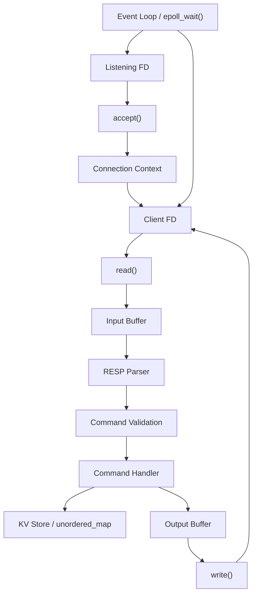

# Kvcache — V1 System Design

**Status:** Completed  
**Version:** V1  
**Document:** `docs/design.md`

---

## 1. Overview

### 1.1 Problem Statement

Kvcache is an in-memory key-value cache server that implements a small Redis-like command set over TCP.

V1 focuses on building a correct, measurable single-core implementation before introducing more advanced features. The server uses a single-threaded event loop with non-blocking I/O and `epoll` to handle multiple concurrent client connections.

The main objective of V1 is to establish a reproducible baseline for correctness, latency, throughput, connection capacity, CPU utilization, and memory utilization. Multi-core processing and other advanced features will be considered only after profiling identifies a concrete bottleneck.

### 1.2 V1 Scope

V1 supports:

- `GET`
- `SET`
- `DEL`
- `EXISTS`
- `PING`

The server supports multiple persistent TCP connections and command pipelining.

### 1.3 Future Scope

The following features are intentionally deferred:

#### Cache Features

- TTL
- LRU eviction

#### Performance and Scalability

- Multi-core processing

#### Durability

- Persistence

#### Distributed Features

- Replication

---

## 2. Goals

### 2.1 Correctness

The server must correctly implement the supported command semantics.

| Command  | Condition       | Expected Result               |
| -------- | --------------- | ----------------------------- |
| `SET`    | Valid key/value | Store or replace value        |
| `GET`    | Key exists      | Return stored value           |
| `GET`    | Key missing     | Return cache miss             |
| `DEL`    | Key exists      | Remove key and report success |
| `DEL`    | Key missing     | Report no deletion            |
| `EXISTS` | Key exists      | Return true                   |
| `EXISTS` | Key missing     | Return false                  |
| `PING`   | Valid request   | Return `PONG`                 |

### 2.2 Concurrency

The server must maintain multiple TCP connections simultaneously and process requests independently without allowing one connection to indefinitely block progress for others.

### 2.3 Performance

V1 will be evaluated using:

- **Capacity:** Maximum sustainable concurrent connections before the server enters the observed saturation region.
- **Throughput:** Requests processed per second (RPS).
- **Latency:** Request-response latency measured using p50, p95, and p99.
- **CPU utilization:** CPU consumed by the server under defined workloads.
- **Memory utilization:** Memory consumed by the server under defined workloads.

No throughput or latency target is assumed before measurement.

### 2.4 Reliability

The server must handle normal disconnects, connection errors, malformed client input, and configured resource limits without crashing.

When the server cannot safely continue processing a connection, that connection should be terminated without affecting other clients.

### 2.5 Extensibility

Networking, protocol parsing, command validation, command execution, and cache storage should remain logically separated so future features such as TTL, LRU, or alternative storage implementations can be introduced without large changes to unrelated code.

---

## 3. Non-Goals

The following features are outside V1.

| Feature               | Reason for Exclusion                                                                                                               |
| --------------------- | ---------------------------------------------------------------------------------------------------------------------------------- |
| Persistence           | Introduces disk I/O, recovery, serialization, and crash-consistency concerns that are unrelated to the initial in-memory baseline. |
| Replication           | Requires multiple instances, state synchronization, consistency decisions, and failure handling.                                   |
| Clustering            | Requires distributed request routing and cluster membership, while V1 is a single-server design.                                   |
| Multi-core processing | V1 first establishes a single-core baseline. Multi-core support should be driven by profiling evidence.                            |
| Authentication        | V1 targets a controlled development environment and focuses on the core request path.                                              |
| TTL                   | Adds expiration semantics and time-based processing.                                                                               |
| Transactions          | Adds command grouping and atomicity semantics beyond the V1 command model.                                                         |
| Pub/Sub               | Uses an asynchronous message-delivery model different from the request-response cache path.                                        |
| LRU eviction          | Adds recency metadata, eviction policy, and capacity management.                                                                   |
| TLS                   | Transport security is deferred while V1 remains a controlled development deployment.                                               |

---

## 4. Requirements

### 4.1 Functional Requirements

#### Server Startup

- The server must listen on a configurable TCP port.
- The listening socket must use non-blocking I/O.

#### Connection Management

- The server must accept incoming TCP connections.
- Each accepted client must have independent connection state.
- Client connections remain open across multiple requests.
- A connection is closed on client disconnect, connection-level failure, protocol violation requiring termination, or server shutdown.

#### Request Processing

- The server must correctly handle TCP stream fragmentation.
- A request may span multiple `read()` calls.
- One `read()` may contain multiple complete requests.
- Complete requests must be parsed, validated, executed, and responded to in order.

#### Command Execution

- Supported commands must be validated before execution.
- Invalid commands or invalid arguments must not modify the key-value store.
- Supported valid commands must produce deterministic RESP-compatible responses.

#### Response Handling

- Responses must be returned to the requesting client.
- Partial writes must be handled correctly.
- Pending response data must remain buffered until it is written or the connection is closed.

#### Invalid Input

- Malformed RESP must not crash the server.
- Unsupported commands and invalid command arguments must return an error response.
- Connection handling depends on whether request framing remains trustworthy.

#### Shutdown

- The server must stop accepting new clients.
- Active client connections must be closed.
- Associated resources must be released before process termination.

### 4.2 Non-Functional Requirements

#### Performance

V1 will measure both individual command performance and a representative mixed workload.

#### Capacity

Capacity is determined from the observed saturation or knee point as concurrent connections are increased.

#### Latency

p50, p95, and p99 are recorded for the V1 benchmark baseline.

#### Resource Utilization

CPU and memory utilization will be measured under defined workloads.

#### Reliability

The server must remain stable while operating within configured resource limits and must reject or terminate work gracefully when those limits are exceeded.

---

## 5. V1 Architecture

### 5.1 Architecture Overview

V1 uses a single-threaded, event-driven architecture based on `epoll`.

The event loop monitors the listening socket and active client sockets. When a new connection is ready, the server accepts it, creates connection state, and registers the new file descriptor with `epoll`.

For an active client, incoming bytes are read into the connection's input buffer. Complete RESP requests are parsed, validated, and executed against the in-memory key-value store. Generated responses are appended to the connection's output buffer and written back using non-blocking I/O.



### 5.2 Threading Model

V1 runs the complete request path on one thread.

This keeps the first implementation deterministic and avoids synchronization, ownership, and cross-thread coordination in the baseline.

A thread-per-core architecture is deferred because it introduces additional decisions around connection distribution and state ownership. A worker-pool architecture is also deferred because queues and shared work distribution add coordination overhead that is not required for the initial baseline.

Multi-core execution should be introduced only if profiling shows that the single-core request path is the limiting factor.

### 5.3 Event Loop and I/O Model

The server uses `epoll` in edge-triggered (ET) mode with non-blocking sockets.

For every readiness notification, the server continues the corresponding operation until it reaches `EAGAIN`.

For reads:

```text
EPOLLIN
   ↓
read()
   ↓
read again while data is available
   ↓
EAGAIN
   ↓
return to event loop
```

For writes:

```text
pending output
   ↓
write()
   ↓
continue while socket accepts data
   ↓
buffer empty OR EAGAIN
```

This behavior is required for correctness with ET mode because another readiness edge is not guaranteed while unread or unwritten data is still available.

### 5.4 Connection Management

Each client connection is represented by connection-specific state containing:

- Client file descriptor
- Input buffer
- Output buffer

The connection remains active across multiple requests.

Connection lifecycle:

```text
accept()
   ↓
create connection state
   ↓
register FD with epoll
   ↓
process read/write events
   ↓
disconnect / connection error / protocol failure / shutdown
   ↓
remove FD from epoll
   ↓
close FD
   ↓
release connection state
```

### 5.5 Request Processing Flow

For an active connection:

1. Read available bytes from the non-blocking socket.
2. Append them to the connection input buffer.
3. Attempt to parse one complete RESP request.
4. If the request is incomplete, retain the bytes and wait for more input.
5. If the request is complete, validate the command and arguments.
6. Execute valid commands against the key-value store.
7. Generate the corresponding RESP response.
8. Append the response to the output buffer.
9. Continue processing additional complete pipelined requests already present in the input buffer.
10. Write pending output when the socket is writable.

TCP stream behavior must be handled explicitly:

- One request may span multiple reads.
- One read may contain multiple requests.
- An incomplete trailing request remains buffered.
- Responses may require multiple writes.
- Responses must preserve request order for a connection.

### 5.6 Data Storage

V1 uses:

```cpp
std::unordered_map<std::string, std::string>
```

as the in-memory key-value store.

#### Limits

- Maximum key size: **10 bytes**
- Maximum value size: **20 bytes**
- No application-level maximum number of entries

The map owns the stored `std::string` objects, so key/value lifetime is independent of the connection input buffer from which the request was parsed.

Supported operations map directly to hash-table operations:

- `GET` performs lookup.
- `SET` inserts a new key or replaces an existing value.
- `DEL` removes an existing key.
- `EXISTS` checks for key presence.

`std::unordered_map` provides expected average **O(1)** lookup, insertion, and deletion. Worst-case behavior can degrade to **O(n)**.

Rehashing is managed by the container. A `SET` may trigger a rehash and temporarily incur higher latency because existing entries must be redistributed across the new bucket structure.

V1 does not attempt to eliminate this behavior in advance. Rehashing, allocation, hashing, and lookup cost will be evaluated using profiling and benchmarks before considering a custom storage implementation.

### 5.7 Response Handling

Generated responses are appended to the connection's output buffer.

Because client sockets are non-blocking, a single `write()` is not assumed to send the full response.

The write path follows these rules:

- Continue writing while the socket accepts data.
- Remove successfully written bytes from pending output.
- On a partial write, retain the remaining bytes.
- On `EAGAIN`, retain pending data and enable `EPOLLOUT`.
- When `EPOLLOUT` is received, continue writing.
- Disable `EPOLLOUT` once the output buffer becomes empty.
- Close the connection on a connection-level write error.

`EPOLLOUT` is monitored only while the connection has pending output. This avoids continuously receiving writable notifications for idle connections.

Responses for pipelined requests are appended and written in the same order in which the requests are executed.

---

## 6. Protocol Design

### 6.1 Protocol Choice

V1 uses a RESP-compatible subset for client-server communication.

RESP was selected because it provides explicit message framing and data representation without requiring a custom protocol to be designed and debugged before the server request path can be evaluated.

V1 does not attempt to implement the complete RESP specification. Only the types required by the supported command set are implemented.

### 6.2 Supported RESP Subset

V1 supports:

- **Arrays** — command plus arguments
- **Bulk Strings** — command names, keys, and values
- **Null Bulk String** — `GET` miss
- **Simple Strings** — `OK`, `PONG`
- **Integers** — `DEL` and `EXISTS` results
- **Errors** — protocol and command-validation failures

Other RESP types are outside V1.

### 6.3 Request Format

Commands are accepted only as RESP arrays of bulk strings.

General format:

```text
*<element-count>\r\n
$<length>\r\n
<command>\r\n
$<length>\r\n
<argument>\r\n
...
```

The number following `*` is the number of array elements. The number following `$` is the bulk-string length in bytes.

Inline commands such as:

```text
GET foo\r\n
```

are not supported in V1.

#### `PING`

```text
*1\r\n
$4\r\n
PING\r\n
```

#### `GET foo`

```text
*2\r\n
$3\r\n
GET\r\n
$3\r\n
foo\r\n
```

#### `SET foo bar`

```text
*3\r\n
$3\r\n
SET\r\n
$3\r\n
foo\r\n
$3\r\n
bar\r\n
```

#### `DEL foo`

```text
*2\r\n
$3\r\n
DEL\r\n
$3\r\n
foo\r\n
```

#### `EXISTS foo`

```text
*2\r\n
$6\r\n
EXISTS\r\n
$3\r\n
foo\r\n
```

### 6.4 Response Format

| Command                    | Result      | RESP Response              |
| -------------------------- | ----------- | -------------------------- |
| `PING`                     | Success     | `+PONG\r\n`                |
| `SET`                      | Success     | `+OK\r\n`                  |
| `GET`                      | Key exists  | `$<length>\r\n<value>\r\n` |
| `GET`                      | Key missing | `$-1\r\n`                  |
| `DEL`                      | Key exists  | `:1\r\n`                   |
| `DEL`                      | Key missing | `:0\r\n`                   |
| `EXISTS`                   | Key exists  | `:1\r\n`                   |
| `EXISTS`                   | Key missing | `:0\r\n`                   |
| Invalid request or command | Error       | `-ERR <message>\r\n`       |

A missing key for `GET` is a normal cache miss and is not treated as an error.

### 6.5 Parsing and Validation

Parsing and command validation are separate stages.

The RESP parser is responsible only for framing and protocol syntax. Command validation runs only after a complete request has been extracted.

#### RESP Parsing

The parser consumes bytes from the connection input buffer and returns one of three outcomes:

- **Complete** — one full request was parsed.
- **Incomplete** — the buffered bytes are a valid prefix, but more data is required.
- **Malformed** — the request violates the supported RESP framing rules.

For a complete request, the parser verifies:

- Top-level array framing
- Array element count encoding
- Bulk-string length encoding
- Required `\r\n` delimiters
- Availability of the declared number of bulk-string bytes

The parser does not execute commands and does not access the key-value store.

When a request is complete, exactly the consumed bytes are removed from the input buffer.

#### Command Validation

A successfully parsed request is validated against the V1 command contract.

| Command  | Arguments | Validation                                              |
| -------- | --------: | ------------------------------------------------------- |
| `PING`   |         0 | No arguments                                            |
| `GET`    |         1 | Non-empty key, maximum 10 bytes                         |
| `SET`    |         2 | Non-empty key, maximum 10 bytes; value maximum 20 bytes |
| `DEL`    |         1 | Non-empty key, maximum 10 bytes                         |
| `EXISTS` |         1 | Non-empty key, maximum 10 bytes                         |

Unsupported commands, incorrect argument counts, and invalid key/value sizes return a RESP error and are not executed.

Because RESP framing is still valid in these cases, the client connection remains open.

### 6.6 Pipelining

V1 supports command pipelining.

A client may send multiple RESP commands without waiting for each previous response.

The server processes pipelined requests sequentially:

```text
Input Buffer
    ↓
Extract one complete request
    ↓
Validate
    ↓
Execute
    ↓
Generate response
    ↓
Append response to Output Buffer
    ↓
Another complete request?
    ├── Yes → Repeat
    └── No  → Wait for more input
```

Responses are appended to the output buffer in request-processing order.

If the final request in the input buffer is incomplete, those bytes remain buffered until more data arrives.

### 6.7 Protocol Limits and Error Handling

V1 uses fixed per-connection limits.

| Resource      |      Limit |
| ------------- | ---------: |
| Input buffer  | 1024 bytes |
| Output buffer | 1024 bytes |
| Key           |   10 bytes |
| Value         |   20 bytes |

Parsed requests are consumed from the input buffer so that the space can be reused.

#### Incomplete RESP

An incomplete request is not considered an error while it remains within the configured input-buffer limit.

The bytes remain buffered until more data arrives.

#### Malformed RESP

Malformed RESP is treated as a connection-level protocol error.

Examples include:

- Invalid array length encoding
- Invalid bulk-string length encoding
- Missing RESP delimiters
- Framing that cannot be parsed according to the supported subset

The server returns a protocol error when possible and then closes the connection.

The connection is closed because malformed framing means the next request boundary cannot be trusted.

#### Valid RESP with Invalid Command or Arguments

A syntactically valid RESP request may still fail command validation.

Examples include:

- Unsupported command
- Incorrect number of arguments
- Key larger than 10 bytes
- Value larger than 20 bytes
- Missing required argument

The server returns:

```text
-ERR <message>\r\n
```

and keeps the connection open.

#### Buffer Limit Handling

If the input buffer reaches 1024 bytes and a complete request cannot be extracted, the server returns an error when possible and closes the connection.

If appending a generated response would exceed the 1024-byte output-buffer limit, the connection is closed rather than allowing pending output to grow without bound.

| Condition                                           | Action                                                |
| --------------------------------------------------- | ----------------------------------------------------- |
| Incomplete RESP within input-buffer limit           | Wait for more data                                    |
| Malformed RESP                                      | Return protocol error when possible; close connection |
| Valid RESP, unsupported command                     | Return error; keep connection open                    |
| Valid RESP, invalid arguments                       | Return error; keep connection open                    |
| Input-buffer limit reached without complete request | Return error when possible; close connection          |
| Output buffer would exceed limit                    | Close connection                                      |

---

## 7. Implementation Design

### 7.1 Core Data Structures

V1 maintains three main categories of runtime state: server state, per-connection state, and the key-value store.

#### ConnectionContext

Each active client is represented by a `ConnectionContext`.

Conceptually:

```cpp
struct ConnectionContext {
    int fd;
    InputBuffer input_buffer;
    OutputBuffer output_buffer;
};
```

The input and output buffers are limited to **1024 bytes** per connection, as defined by the protocol limits.

When a client socket is registered with `epoll`, a pointer to its `ConnectionContext` is stored in `epoll_event.data.ptr`.

```cpp
epoll_event event{};
event.events = EPOLLIN | EPOLLET;
event.data.ptr = connection_context;
```

This allows the event loop to access the connection state directly when `epoll_wait()` returns an event, without performing an additional file-descriptor-to-connection lookup on the request-processing path.

```text
epoll_wait()
    ↓
epoll_event.data.ptr
    ↓
ConnectionContext
    ├── fd
    ├── input buffer
    └── output buffer
```

`epoll` does not own the `ConnectionContext`; it only stores the pointer. The connection object must therefore remain valid for the entire time the client file descriptor is registered with `epoll`.

#### Connection Registry

The server maintains a registry of active connections:

```cpp
std::unordered_map<int, std::unique_ptr<ConnectionContext>> connections;
```

The registry owns the `ConnectionContext` objects and provides lifecycle management for active clients.

The map is not required for normal event dispatch because the event loop accesses the connection directly through `epoll_event.data.ptr`.

It is retained for:

- Ownership of connection objects
- Tracking active connections
- Cleanup during server shutdown
- Removing connections when they are closed
- Connection accounting and debugging

When a connection is terminated, cleanup occurs in the following order:

```text
Remove FD from epoll
    ↓
Close client FD
    ↓
Erase ConnectionContext from connection registry
```

This ensures that the pointer stored by `epoll` does not outlive the corresponding connection object.

#### Key-Value Store

The cache storage remains:

```cpp
std::unordered_map<std::string, std::string> kv_store;
```

The key-value store is owned by the server and accessed only by the single event-loop thread in V1. No synchronization is required because command execution is single-threaded.

### 7.2 Event Loop Processing

The event loop is responsible for accepting new connections and processing I/O readiness notifications for active clients.

V1 uses `epoll_wait()` as the central dispatch point. Client events store a pointer to the corresponding `ConnectionContext` in `epoll_event.data.ptr`, which allows the event loop to access the client file descriptor and connection buffers directly without performing an additional lookup.

The listening socket is registered separately and is identified by a reserved `data.ptr` value.

#### Accept Path

When the listening socket becomes readable, the server accepts connections repeatedly until `accept()` returns `EAGAIN`.

Because V1 uses edge-triggered `epoll`, processing only a single pending connection could leave additional connections unaccepted without another readiness notification.

For every accepted connection, the server:

1. Creates a new `ConnectionContext`.
2. Configures the client socket as non-blocking.
3. Stores the context in the active connection registry.
4. Registers the client file descriptor with `epoll`.
5. Stores a pointer to the `ConnectionContext` in `epoll_event.data.ptr`.

The accept path is:

```text
EPOLLIN on listening socket
        ↓
accept connection
        ↓
create ConnectionContext
        ↓
set client socket non-blocking
        ↓
store connection in registry
        ↓
register client FD with epoll
        ↓
accept next connection
        ↓
repeat until EAGAIN
```

#### Read Processing

When `EPOLLIN` is received for a client, the server drains the socket until `read()` returns `EAGAIN`.

Received bytes are appended to the connection input buffer. Complete requests are parsed and processed while data is being drained so that consumed bytes can free buffer capacity for additional incoming data.

The read path is:

```text
EPOLLIN
   ↓
read available bytes
   ↓
append to input buffer
   ↓
parse complete requests
   ↓
validate and execute
   ↓
generate response
   ↓
consume parsed input
   ↓
continue reading
   ↓
EAGAIN
   ↓
return to event loop
```

The parser may return:

- **Complete** — process the request and continue parsing.
- **Incomplete** — retain the remaining bytes and wait for more data.
- **Malformed** — treat the request as a protocol error and close the connection after generating an error response when possible.

If `read()` returns `0`, the peer has closed the connection and the server begins connection cleanup.

An unrecoverable read error also results in connection cleanup.

#### Write Processing

Once a complete response has been generated, it is appended to the connection output buffer.

The server attempts to flush pending output immediately instead of waiting for the output buffer to become full.

Writes continue until:

- the output buffer becomes empty, or
- `write()` returns `EAGAIN`.

If `write()` returns `EAGAIN`, the unsent bytes remain in the output buffer and `EPOLLOUT` is enabled for that connection.

When a later `EPOLLOUT` event is received, the server resumes writing pending data.

Once the output buffer becomes empty, `EPOLLOUT` is disabled to avoid unnecessary writable notifications.

If appending a response would exceed the configured output-buffer limit, the server first attempts to flush existing pending output. If enough space still cannot be made available, the connection is closed according to the configured protocol limits.

#### Event Processing Order

For a client event, the server first checks for connection-level errors or hangups, then processes readable and writable events.

If processing an event causes the connection to be closed, no further work is performed using that `ConnectionContext`.

This prevents use-after-free scenarios when `epoll_event.data.ptr` refers to connection state that has been removed from the active connection registry.

### 7.3 Connection Lifecycle

Each client connection remains active from the time it is accepted until the peer disconnects, a connection-level failure occurs, a protocol limit requires termination, or the server shuts down.

The lifecycle is:

```text
accept()
   ↓
create ConnectionContext
   ↓
insert into active connection registry
   ↓
register client FD with epoll
   ↓
process EPOLLIN / EPOLLOUT events
   ↓
connection termination condition
   ↓
remove FD from epoll
   ↓
close client FD
   ↓
erase ConnectionContext from registry
```

A connection is terminated when:

- `read()` returns `0`, indicating that the peer has closed the connection.
- An unrecoverable socket read or write error occurs.
- A malformed RESP request is received.
- The configured input-buffer limit is violated.
- The configured output-buffer limit is violated.
- The server is shutting down.

A syntactically valid RESP request with an unsupported command or invalid arguments does not terminate the connection. The server returns an error response and continues processing subsequent requests.

#### Connection Cleanup

Connection cleanup is centralized in a single path so that all termination conditions release resources consistently.

The cleanup order is:

1. Remove the client file descriptor from `epoll`.
2. Close the client file descriptor.
3. Remove the corresponding `ConnectionContext` from the active connection registry.

The `ConnectionContext` must remain valid until the file descriptor has been removed from `epoll`, because `epoll_event.data.ptr` contains a pointer to that object.

Erasing the connection context before removing the file descriptor from `epoll` could leave a dangling pointer and result in invalid memory access if the event is processed later.

V1 keeps the per-connection state minimal:

```cpp
struct ConnectionContext {
    int fd;
    InputBuffer input_buffer;
    OutputBuffer output_buffer;
};
```

Additional connection state will be introduced only if required by later implementation or profiling.

---

## 8. Performance Evaluation

The V1 performance evaluation is intended to establish a reproducible single-core baseline and identify the point at which the current architecture begins to saturate.

The benchmark plan is divided into three parts:

1. Single-command microbenchmarks
2. Connection-capacity testing
3. Mixed-workload testing

All official V1 results are collected from a Release build.

### 8.1 Benchmark Environment

The Kvcache server and benchmark client run on the same host and communicate over TCP loopback using `127.0.0.1`.

To reduce interference between the client and server, they are pinned to different CPU cores.

Example:

```bash
taskset -c 2 ./kvcache
taskset -c 3 ./benchmark_client
```

This setup measures end-to-end local request latency, including client-side request generation, TCP loopback transport, server processing, and response delivery.

The benchmark client uses a persistent TCP connection unless the benchmark explicitly requires multiple connections.

CPU and memory utilization are measured independently from the benchmark client. The server process is sampled during the measurement window using tools such as `pidstat`.

The primary resource metrics are:

- CPU utilization
- Resident Set Size (RSS)

### 8.2 Common Benchmark Configuration

Unless a benchmark specifies otherwise, the following configuration is used:

| Parameter               | Value       |
| ----------------------- | ----------- |
| Preloaded dataset       | 10,000 keys |
| Key size                | 10 bytes    |
| Value size              | 20 bytes    |
| Connection type         | Persistent  |
| Pipelining              | Disabled    |
| Warm-up duration        | 10 seconds  |
| Measurement duration    | 30 seconds  |
| Runs per benchmark case | 10          |

The benchmark client uses a deterministic key-selection sequence with a fixed seed so repeated runs use comparable access patterns.

Warm-up operations use a separate key range from the measurement dataset. After warm-up, the measurement dataset is prepared or reset before the timed run begins.

Each benchmark run starts from a known server state.

### 8.3 Metrics

The following metrics are reported:

- Requests per second (RPS)
- p50 latency
- p95 latency
- p99 latency
- CPU utilization
- RSS
- Request errors or unexpected disconnects

Request latency is measured using a monotonic clock from immediately before request transmission until the complete corresponding response has been received.

The benchmark client records latency samples only during the 30-second measurement window.

For each benchmark case, the reported value is derived from 10 independent runs. Median results across runs are used to reduce sensitivity to one noisy execution.

No performance target is assumed in advance. The results are used to establish the V1 baseline and identify bottlenecks that justify future changes.

### 8.4 Single-Command Microbenchmarks

Each supported command is benchmarked independently.

The goal is to isolate command-path behavior rather than hiding different execution paths inside one aggregate workload.

The following cases are measured:

| Command  | Benchmark Cases           |
| -------- | ------------------------- |
| `PING`   | Request/response baseline |
| `GET`    | Hit, Miss                 |
| `SET`    | Insert, Update            |
| `DEL`    | Hit, Miss                 |
| `EXISTS` | Hit, Miss                 |

#### GET Hit

The requested key is selected from the 10,000-key preloaded dataset.

#### GET Miss

The requested key is guaranteed not to exist in the dataset.

#### SET Update

The request updates an existing key from the preloaded dataset.

#### SET Insert

The request inserts a key that does not currently exist.

The dataset is allowed to grow during the measurement period. This intentionally captures insertion behavior, including allocation and any `std::unordered_map` growth or rehash effects.

#### DEL Hit

`DEL` hit requires special handling because deleting keys changes the dataset.

The benchmark operates in cycles:

```text
prepare 10,000 existing keys
        ↓
measure DEL hit operations
        ↓
dataset exhausted
        ↓
repopulate keys
        ↓
continue measurement
```

Dataset repopulation is excluded from DEL latency and throughput measurements.

#### DEL Miss

Requests target keys that do not exist.

#### EXISTS Hit / Miss

Hit requests target existing keys. Miss requests use keys that are guaranteed not to exist.

### 8.5 Capacity Testing

Capacity testing evaluates how the single-threaded server behaves as the number of concurrent persistent clients increases.

The primary capacity workload is:

```text
Command:              GET
Result:               Hit
Dataset:              10,000 keys
Pipelining:           Disabled
Outstanding requests: 1 per connection
```

Concurrency is increased exponentially:

```text
1 → 2 → 4 → 8 → 16 → 32 → ...
```

At every concurrency level, the benchmark records:

- RPS
- p50 latency
- p95 latency
- p99 latency
- CPU utilization
- RSS
- Errors and disconnects

Testing continues until the server enters a clear saturation region.

Capacity is not defined using a fixed connection count or an arbitrary latency threshold. Instead, the benchmark identifies the system's knee point using observed behavior.

Indicators of saturation include:

- CPU approaching single-core saturation
- Throughput no longer increasing meaningfully as concurrency increases
- p95 or p99 latency increasing sharply
- Errors or unexpected disconnects appearing
- Configured resource limits being reached

Once the approximate knee point is identified using exponential growth, additional measurements are taken with smaller concurrency increments around that region.

The highest concurrency level before the observed saturation region is treated as the V1 sustainable-capacity baseline.

### 8.6 Mixed Workload

After single-command and capacity testing, V1 is evaluated using an initial representative mixed workload.

The distribution is:

| Command  | Distribution | Behavior            |
| -------- | -----------: | ------------------- |
| `GET`    |          70% | Existing key        |
| `SET`    |          20% | Update existing key |
| `EXISTS` |           5% | Existing key        |
| `DEL`    |           5% | Missing key         |

This distribution is an initial workload hypothesis for evaluation. It is not intended to represent a universal production cache workload.

The workload is deliberately state-stable:

- `GET` accesses existing keys.
- `SET` updates existing keys.
- `EXISTS` checks existing keys.
- `DEL` targets missing keys.

This keeps the working dataset approximately constant during the run and avoids mixing request-path performance with continuous dataset growth or shrinkage.

The mixed workload is measured at three concurrency regions derived from the GET-hit capacity test:

- **Low load:** Clearly below the saturation point.
- **Near knee:** Around the observed capacity point.
- **High load:** Slightly beyond the knee.

At each load level, the benchmark reports the same metrics used by the other V1 tests:

- RPS
- p50 latency
- p95 latency
- p99 latency
- CPU utilization
- RSS
- Errors and disconnects

The mixed-workload result is used to determine whether the saturation behavior observed in the GET-only capacity test remains similar when command execution includes both reads and writes.

### 8.7 Profiling and Follow-up

Benchmark results establish where performance degrades, but they do not by themselves identify the cause.

When a meaningful bottleneck is observed, profiling is used to determine where CPU time or latency is being spent.

Potential areas include:

- Event-loop processing
- Socket read/write handling
- RESP parsing
- Response generation
- Hash computation and lookup
- Memory allocation
- `std::unordered_map` rehashing

Architecture changes are driven by measured evidence rather than assumed bottlenecks.

Examples include:

- If the event-loop thread reaches sustained CPU saturation, multi-core execution can be evaluated.
- If hash-table operations dominate CPU time, alternative storage implementations can be considered.
- If allocation dominates command processing, buffer or object-allocation strategies can be revisited.
- If tail latency spikes correlate with rehashing, hash-table capacity-management strategies can be evaluated.

The V1 benchmark results therefore serve as both the performance baseline and the input for future architecture decisions.
